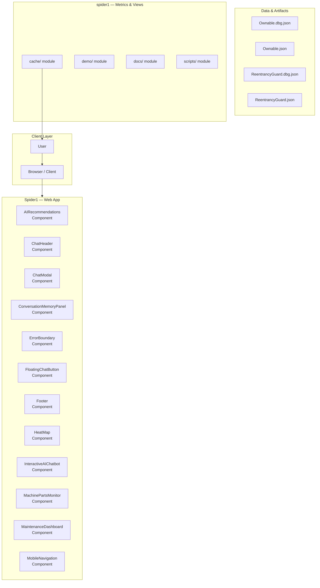
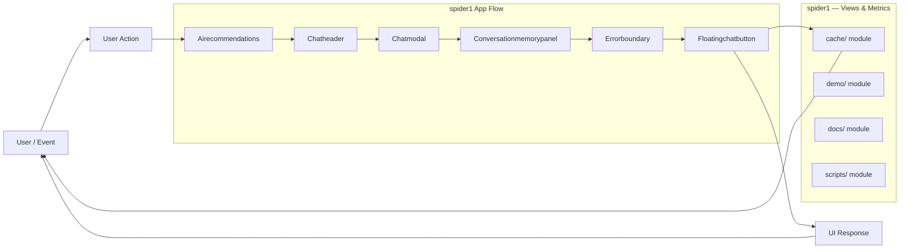
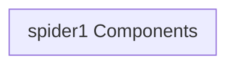
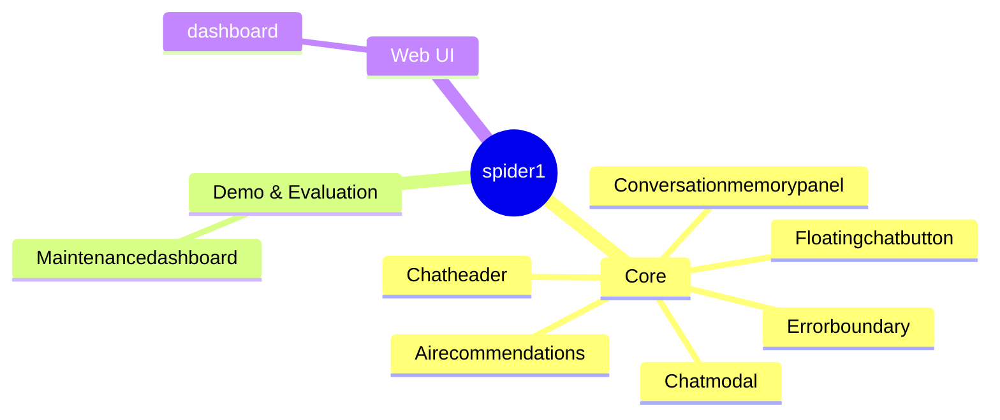
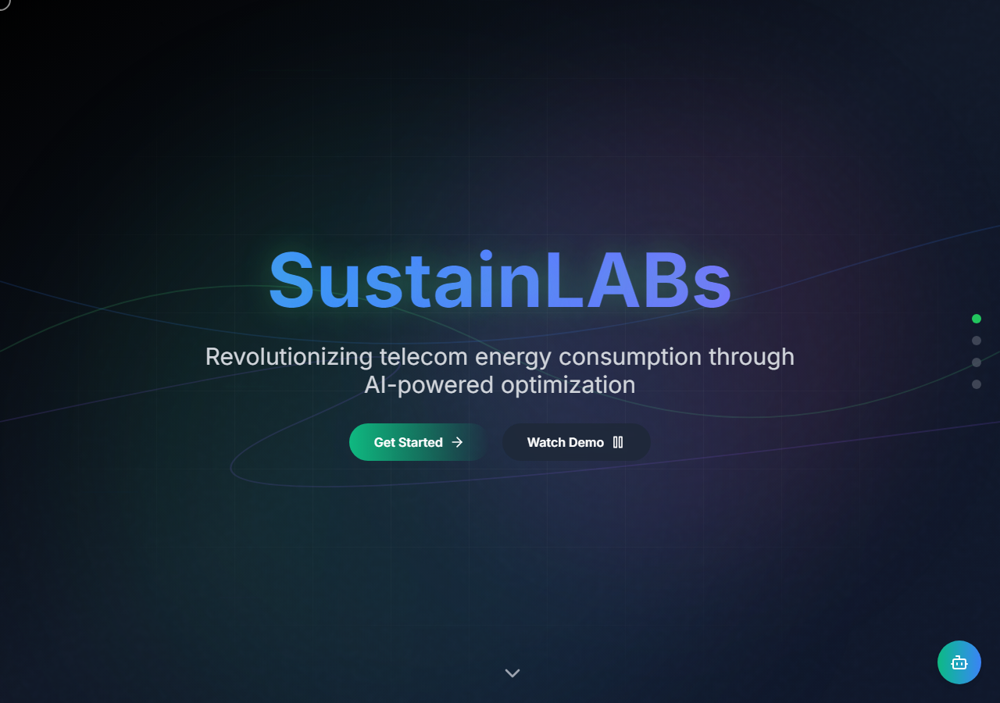

# Project Scope Analysis: Super-App Syndrome Diagnosis

The current dependency list indicates an extremely ambitious 'Super-App' scope, combining advanced visualization, AI, Web3, and geospatial mapping, requiring immediate scope reduction to achieve a Minimum Viable Product (MVP).

## Overview

The provided `package.json` reveals a dependency graph that is far too broad for a single, cohesive MVP. The project attempts to integrate six distinct, highly complex technological domains: 3D Visualization (Three.js/Deck.gl), Geospatial Mapping (Leaflet), Computer Vision (TensorFlow), Blockchain (Ethers/Hardhat), Generative AI (Google GenAI), and Voice Processing (Picovoice). This breadth leads to 'Super-App Syndrome,' where the complexity of integrating all components will delay development and dilute the core value proposition. The current structure is not a single product, but a collection of advanced proof-of-concepts.

## Problem

The project suffers from severe scope creep. By attempting to solve multiple, unrelated, high-complexity problems (e.g., energy resilience, structural monitoring, facial recognition, and decentralized finance) simultaneously, the development team risks feature paralysis, resource exhaustion, and the inability to deliver a polished, focused product within a reasonable timeframe.

## Solution

The solution is not to build all these features, but to select one primary, high-impact narrative thread that can leverage the most unique combination of technologies. We must define a single, measurable problem and build the smallest possible system that solves it end-to-end. This requires ruthlessly pruning dependencies that do not directly support the core narrative.

## Key Features

- 3D Visualization and Simulation (Three.js, Deck.gl)
- Geospatial Data Mapping (Leaflet, Deck.gl)
- AI-Powered Computer Vision (TensorFlow, Face/Hand Detection)
- Decentralized Ledger Interaction (Web3, Ethers, Hardhat)
- Generative AI and Voice Input (Google GenAI, Picovoice)
- Data Reporting and Charting (Chart.js, Recharts)

## Technology Stack

- React
- TypeScript
- JavaScript
- Three.js
- Deck.gl
- Leaflet
- TensorFlow.js
- Web3.js/Ethers.js
- Hardhat
- Chakra UI

# 🕸️ Spider1: Advanced Web Scraping and Data Aggregation Platform

Spider1 is a robust, full-stack platform designed for advanced web scraping, data aggregation, and real-time data visualization. Built with a modern microservices architecture, it allows users to efficiently collect, process, and analyze data from diverse web sources, providing actionable insights into market trends and digital footprints.

---

## 🚀 Getting Started

This guide provides instructions for setting up and running the Spider1 development environment locally.

### Prerequisites

Before starting, ensure you have the following installed:

*   Node.js (LTS recommended)
*   npm or Yarn
*   Docker and Docker Compose (for containerized services)

### Installation

1.  **Clone the Repository:**
    ```bash
git clone [repository-url]
cd spider1
```

2.  **Install Dependencies:**
    ```bash
# Install frontend and backend dependencies
npm install
```

3.  **Run the Application:**
    ```bash
# Start the development server
npm run dev
```

The application should now be accessible at `http://localhost:3000`.

## ⚙️ Architecture Overview

Spider1 utilizes a modular, service-oriented architecture to ensure scalability, maintainability, and fault tolerance. The system is divided into distinct layers: Presentation, Application Logic, Data Processing, and Persistence.

### System Architecture Diagram

This diagram illustrates the high-level interaction between the core services:

### Data Flow

The data lifecycle in Spider1 follows these steps:

1.  **Request:** A user initiates a scraping task via the Frontend UI.
2.  **API Gateway:** The Backend API Gateway receives the request and validates the parameters.
3.  **Task Queue:** The request is placed into a dedicated task queue (e.g., Redis/RabbitMQ) for asynchronous processing.
4.  **Worker Service:** The Scraping Worker Service picks up the task, executes the scraping logic, and retrieves raw data.
5.  **Persistence:** The raw and processed data are written to the primary database (PostgreSQL/MongoDB).
6.  **Notification:** The API Gateway updates the frontend, notifying the user of the task status and providing access to the results.

## 🧩 Core Technical Components

Spider1 is built upon several specialized components, each serving a critical function:

*   **Frontend UI (React/TypeScript):** The user-facing interface. Built with TypeScript for strong typing, ensuring component reliability and developer efficiency.
*   **Backend API Gateway (Express/TypeScript):** The central entry point for all client requests. It handles routing, authentication, and orchestrates calls to various microservices.
*   **Scraping Worker Service:** The core engine. This service manages the lifecycle of scraping tasks, handling concurrency, rate limiting, and data extraction from target websites.
*   **Blockchain Service:** Integrates with external blockchain networks. This service is responsible for recording immutable transaction logs, ensuring data provenance and verifiable data integrity.
*   **Database Layer (PostgreSQL/MongoDB):** The persistence layer. PostgreSQL is used for structured, relational data (user accounts, task metadata), while MongoDB handles flexible, unstructured data (raw scraped content).

## 🗺️ Application Structure and Features

### Component Map

This map details the relationship between the primary application components:

### Feature Modules

| Module | Description | Key Functionality | Target User | 
| :--- | :--- | :--- | :--- | 
| **Dashboard** | Overview of all active and completed scraping tasks. | Quick status checks, task history, and performance metrics. | All Users | 
| **Task Setup** | Defines the parameters for a new scraping job. | URL input, selector definition (CSS/XPath), scheduling, and rate limiting configuration. | Power Users | 
| **Data Processing** | Manages the transformation and cleaning of raw data. | Filtering, normalization, aggregation, and schema mapping. | Data Analysts | 
| **Blockchain Logging** | Records critical task metadata and results immutably. | Proof of collection, verifiable timestamps, and transaction hashing. | Compliance/Audit | 
| **User Management** | Handles user authentication and role-based access control (RBAC). | Registration, login, profile updates, and permission setting. | All Users | 

## 🖥️ User Interface Flow

### 1. Dashboard (Home)

*   **Purpose:** Provides an immediate snapshot of the system's operational status.
*   **Content:** Displays a list of recent tasks, overall data volume collected, and system health indicators.

### 2. Task Creation & Configuration

*   **Purpose:** To define *what* and *where* data needs to be scraped.
*   **Process:** Users input the target URL, select the desired data fields (via CSS/XPath selectors), and set operational parameters (e.g., frequency, concurrency limit).

### 3. Results Viewer

*   **Purpose:** To visualize and export the collected data.
*   **Functionality:** Presents data in an interactive table format, allowing filtering, sorting, and bulk export (CSV, JSON).

## 📚 Contribution Guidelines

We welcome contributions! To get started:

1.  Fork the repository.
2.  Create a new branch (`git checkout -b feature/AmazingFeature`).
3.  Commit your changes (`git commit -m 'Add Awesome Feature'`).
4.  Push to the branch (`git push origin feature/AmazingFeature`).
5.  Open a Pull Request.

Please ensure all new code adheres to TypeScript best practices and includes comprehensive unit tests.

## Setup Guide

### Frontend Setup

```bash

npm install
npm run dev     # development
npm run build && npm start   # production
```

Open `http://127.0.0.1:5173` (or the port shown in the terminal).

### Configuration

Copy environment templates before running:

- `.env.example` → copy to `.env` in the same directory

### Running the Application

1. **Start web app** — `npm run dev` in `./`

```bash
cd .
npm install
npm run dev
```

## System Architecture

High-level system design, data flows, API map, and workflow pipelines derived from the repository structure.

### System Architecture



### Data Flow & Charts Pipeline



### Component & API Map



### Application Page Map



## Screenshots & Assets


## Application Pages

Screenshots captured from the running application. Each page is listed with its function.

### Application

#### Home

Home — application page at `/`



#### Dashboard

Dashboard — application page at `/dashboard`


#### Disaster Monitoring

Disaster Monitoring — application page at `/disaster-monitoring`


#### Gamification

Gamification — application page at `/gamification`


#### Maintenance Mobile

Maintenance Mobile — application page at `/maintenance-mobile`


#### Marketplace

Marketplace — application page at `/marketplace`


#### Network

Network — application page at `/network`


#### Register

Register — application page at `/register`


#### Unauthorized

Unauthorized — application page at `/unauthorized`


