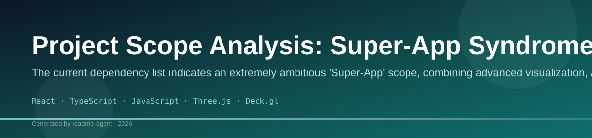
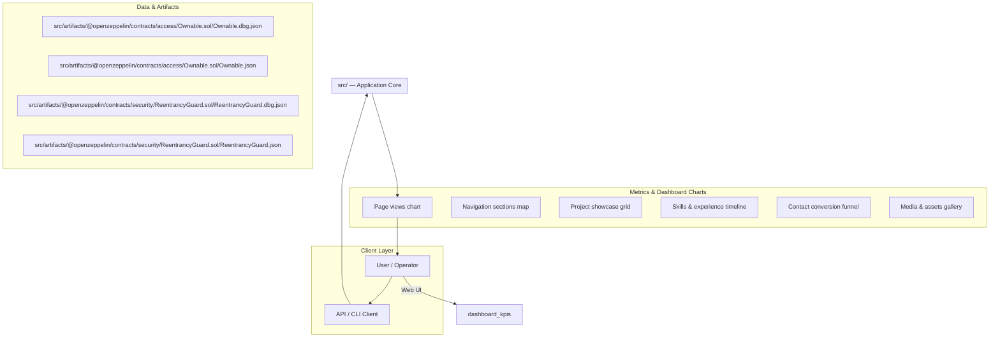
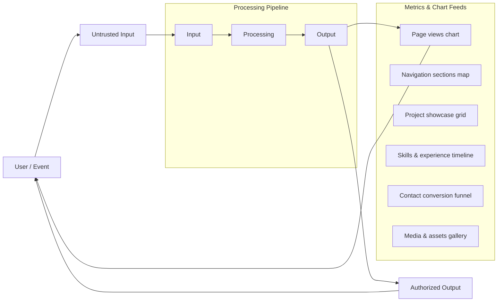
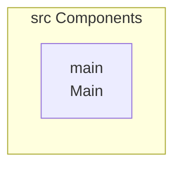
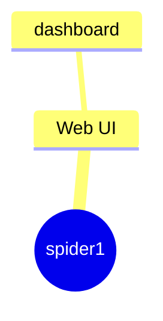
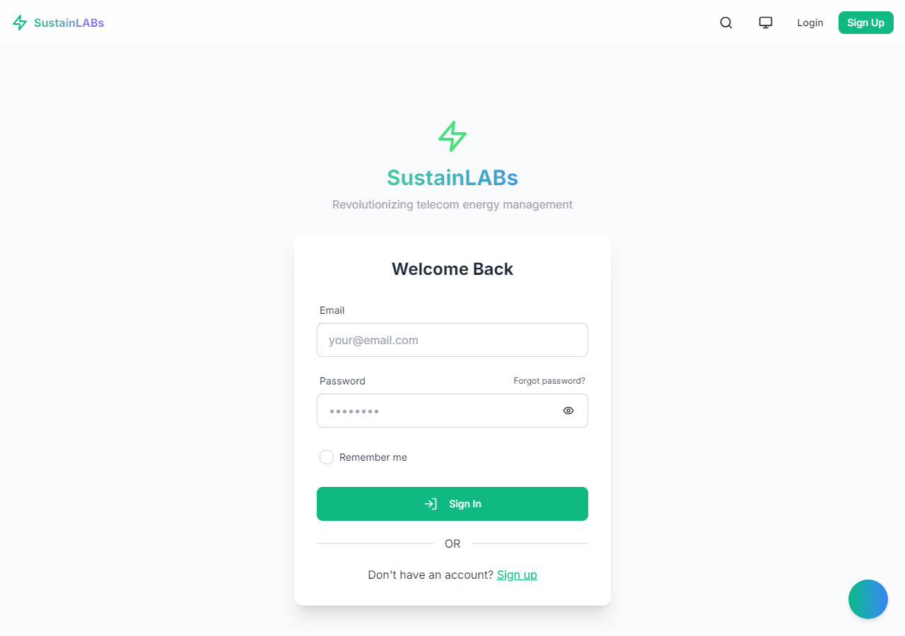
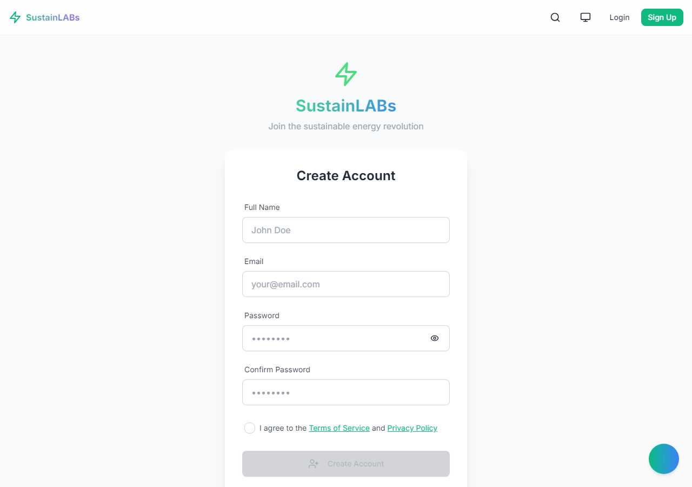
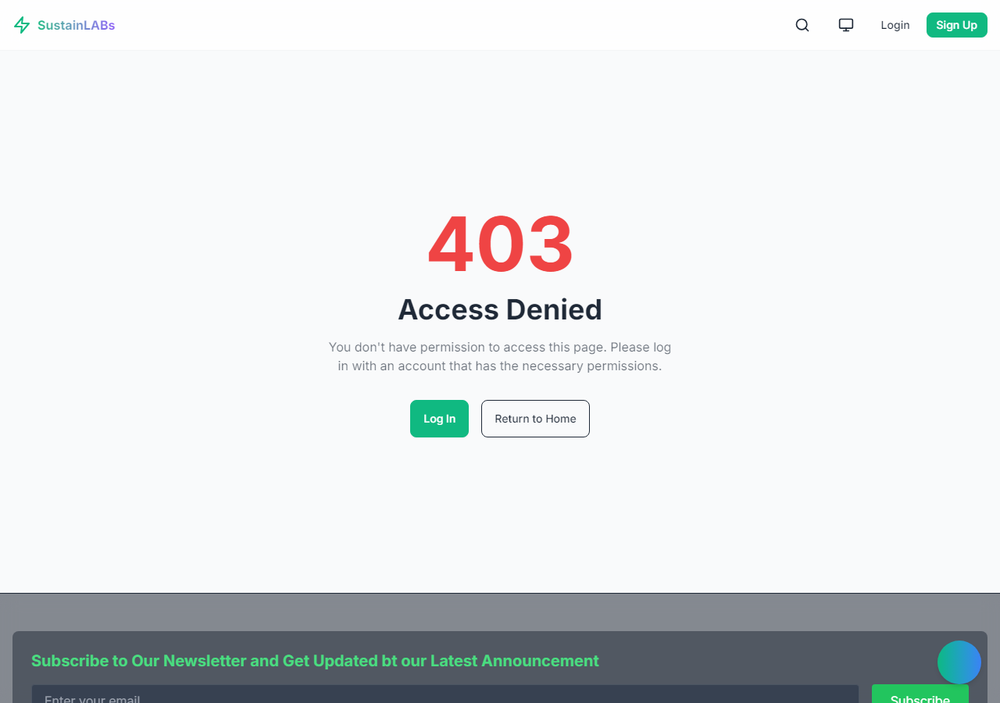

# Project Understanding

A decentralized, AI-powered platform for real-time structural health monitoring and predictive maintenance in critical infrastructure.

## Overview

SustainLABs is a comprehensive IoT and AI solution designed to revolutionize how critical infrastructure (bridges, buildings, pipelines) is monitored. By integrating edge computing, blockchain technology, and advanced machine learning, the platform provides continuous, tamper-proof structural integrity assessments, moving maintenance from reactive to predictive.

## Problem

The current methods of infrastructure monitoring are insufficient, leading to significant economic, safety, and environmental risks. Key pain points include:

## Solution

SustainLABs offers a holistic, end-to-end monitoring ecosystem. It captures real-time sensor data at the edge, processes it using specialized AI models (optimized for low latency), and records the immutable results on a blockchain ledger. This ensures continuous, trustworthy, and actionable insights for proactive maintenance.

## Key Features

- Real-time Structural Health Monitoring (SHM) via IoT sensors.
- Predictive Failure Analysis using AI/ML models.
- Decentralized, Immutable Data Logging using Blockchain (Merkle Tree).
- Edge Computing processing for low-latency data analysis (Groq LPU).
- Comprehensive Dashboard visualization of structural metrics and risk scores.

## Technology Stack

- Python
- JavaScript
- React
- Node.js
- TensorFlow/PyTorch (Implied by AI/ML)
- Blockchain SDK (Implied by Blockchain)
- IoT/Edge Devices (Implied by Sensors/Groq)

## 💡 Overall Assessment: Ambitious, Deep, but Overloaded

**Strengths:** Your project is incredibly ambitious, technically deep, and tackles a massive, high-impact global problem (rural energy access). The sheer breadth of technologies and modules demonstrates a profound understanding of modern decentralized systems (AI, Blockchain, IoT, Edge Computing). The visual structure is excellent for a pitch.

**Area for Improvement (The Core Problem):** The project suffers from severe **scope creep**. You are attempting to build a 'Command Center' that manages energy grids, financial transactions, health records, disaster response, and predictive maintenance—all at once. This makes the pitch feel unfocused, overwhelming, and, critically, unachievable in a short timeframe. 

**The Goal:** Your pitch needs to shift from being a 'collection of amazing features' to being a 'single, cohesive solution to one critical problem.'

---

## 🎯 Strategic Recommendations: Focus and Narrative

### 1. Define the Single Core Problem (The North Star)

Instead of pitching a 'Rural Development Platform,' pitch a **'Decentralized Energy Resilience and Economic Empowerment System.'**

*   **Action:** Choose ONE primary user journey. For example: *How does a local micro-grid operator use our system to predict maintenance needs and facilitate local energy trading?*
*   **Impact:** This immediately cuts the noise. The AI, Blockchain, and IoT components all serve this single narrative, making the pitch feel cohesive and intentional.

### 2. Prune the Scope (The MVP Principle)

You must ruthlessly cut features that do not directly support your chosen core narrative. 

*   **Recommendation:** For the pitch, focus on the **Energy Grid Management** and **Predictive Maintenance** modules. These are the most tightly coupled and impactful. 
*   **De-emphasize/Defer:** The Health Monitoring and Cross-Border Finance modules are too large and distract from the core energy mission. If you must mention them, frame them as **'Phase 2 Expansion Opportunities'** rather than core features.

### 3. Simplify the Tech Stack (The 'Why' vs. The 'What')

Listing 10+ technologies (React, Python, Supabase, MongoDB, Groq, Fluvio, Base, etc.) is overwhelming. It suggests complexity for complexity's sake.

*   **Action:** Group your technologies by function, not by name. Instead of saying, 'We use Fluvio, MongoDB, and Supabase,' say: **'We use a scalable, event-driven backend (e.g., Fluvio/Supabase) to handle high-volume sensor data, while utilizing a decentralized ledger (e.g., Base/Blockchain) for immutable transaction records.'**
*   **Focus on the *Benefit*:** The audience cares that the data is *immutable* (Blockchain benefit), not that you used *Base* (Technology name).

---

## 🗣️ Pitch Delivery & Presentation Tips

### 1. The Opening Hook (The First 60 Seconds)

Do not start with the tech stack. Start with the pain point and the emotional impact.

*   **Weak Start:** 'We are building a platform using React, Python, and Groq...' 
*   **Strong Start:** 'In rural areas, a single power outage doesn't just mean darkness; it means lost income, stalled education, and a cycle of poverty. We are building the decentralized intelligence layer that restores economic resilience.'

### 2. Structure the Narrative Flow

Use this structure for maximum impact:

1.  **The Problem:** (Emotional hook, clear pain point).
2.  **The Solution (The Core):** (Your focused system—e.g., the 'Resilience Command Center').
3.  **How It Works (The Magic):** (Focus on the *process*, not the components. E.g., 'Sensor data feeds into our AI, which predicts failure, triggering a local transaction on the blockchain to fund immediate repairs.')
4.  **The Impact:** (Quantifiable results: 'This increases uptime by X%' or 'This unlocks $Y in local micro-economy revenue.')
5.  **The Future:** (The phased roadmap, mentioning the other modules as Phase 2).

### 3. Visual Presentation (The Demo)

When presenting the UI, do not show all 6 modules at once. **Zoom in.**

*   **Focus:** Spend 80% of your demo time on the single, most compelling user flow (e.g., the Predictive Maintenance workflow). Show the data flowing from the sensor (IoT) $\rightarrow$ the AI (Groq) $\rightarrow$ the action (Blockchain/Dashboard). This makes the complexity feel manageable and powerful.

## Setup Guide

### Frontend Setup

```bash

npm install
npm run dev     # development
npm run build && npm start   # production
```

Open `http://127.0.0.1:5173` (or the port shown in the terminal).

### Configuration

Copy environment templates before running:

- `.env.example` → copy to `.env` in the same directory

### Running the Application

1. **Start web app** — `npm run dev` in `./`

```bash
cd .
npm install
npm run dev
```

## System Architecture

High-level system design, data flows, API map, and workflow pipelines derived from the repository structure.

### System Architecture



### Data Flow & Charts Pipeline



### Component & API Map



### Application Page Map



## Screenshots & Assets


## Application Pages

Screenshots captured from the running application. Each page is listed with its function.

### Application

#### Home

Home — application page at `/`


#### Dashboard

Dashboard — application page at `/dashboard`


#### Disaster Monitoring

Disaster Monitoring — application page at `/disaster-monitoring`


#### Gamification

Gamification — application page at `/gamification`


#### Maintenance Mobile

Maintenance Mobile — application page at `/maintenance-mobile`


#### Network

Network — application page at `/network`



#### Register

Register — application page at `/register`



#### Unauthorized

Unauthorized — application page at `/unauthorized`


